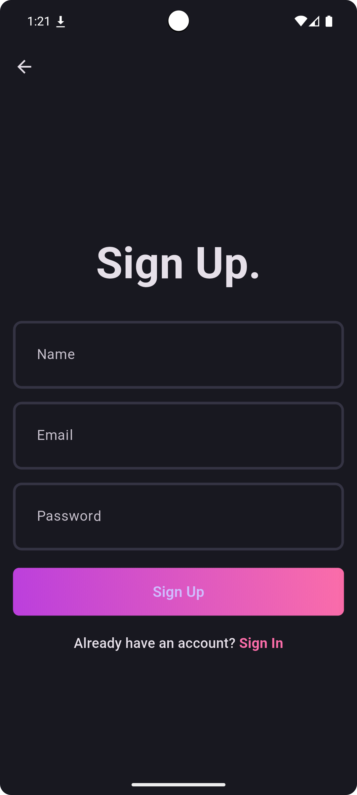
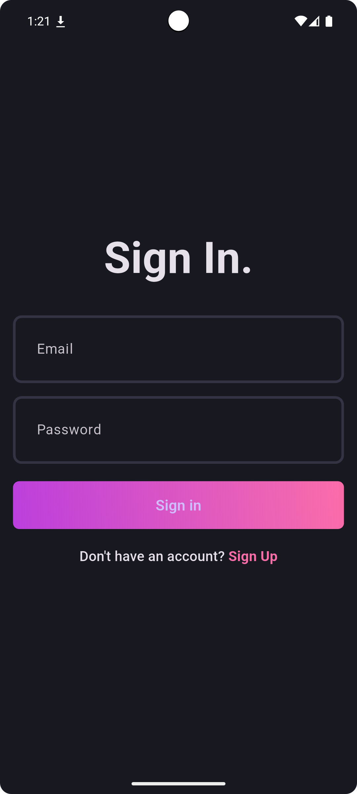
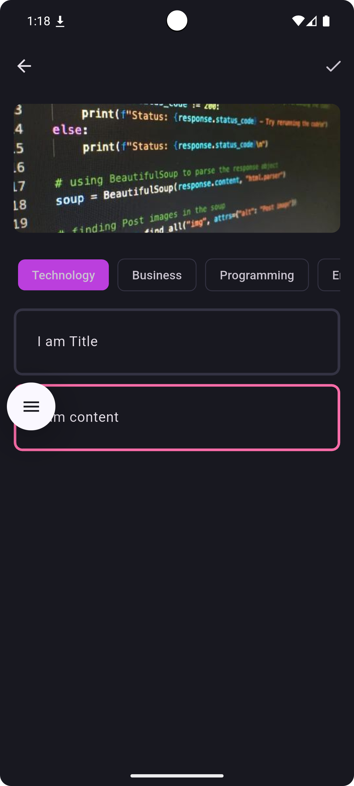

# Blog App

Welcome to the **Blog App**, a simple yet powerful platform built with **Flutter** and **Supabase**. This app allows users to log in, sign up, create and share blogs, and read blogs from others. Users can add titles, content, choose topics, upload images, and filter blogs by topics.

## Features

- **Login & Signup**: Users can sign up with a new account or log in to an existing one.
- **Create Blog**: Users can create new blogs by adding a title, content, selecting a topic, and uploading an image.
- **Read Blogs**: View blogs from other users with the option to filter blogs based on topics.
- **Image Upload**: Users can upload images to accompany their blog posts.
- **Topic Filtering**: Filter blogs based on the selected topic.

## Screenshots

Below are some screenshots of the app:

### 1. **Signup Page**

Users can create a new account on this page.



### 2. **Signin Page**

Users can log in with their credentials on this page.



### 3. **Add New Blog**

Users can write and add new blogs by entering a title, content, and uploading images.



### 4. **View All Blog**

Users can view all blogs.


### 5. **View Blog Page**

Users can view and read blogs posted by others.


## Installation

Follow the steps below to set up the Blog App locally:

### 1. Clone the repository:

```bash
git clone https://github.com/piro-piyush/blog_app.git
cd blog_app
```

### 2. Install dependencies:

If you're using Flutter, run the following command:

```bash
flutter pub get
```

### 3. Set up Supabase:

- Create a project on [Supabase](https://supabase.io).
- Set up your database schema according to your app's needs (e.g., users, blogs, topics).
- Create a `.env` file in the root directory and add your Supabase credentials like this:

```bash
SUPABASE_URL=your_supabase_url
SUPABASE_ANON_KEY=your_supabase_anon_key
```

### 4. Run the app:

Run the app using the following command:

```bash
flutter run
```

The app will launch on your default device or emulator.

### 5. Open the app in your browser or mobile device:

Once everything is set up, you can use the app at `http://localhost:3000` or on your connected device.

## Database Schema

Below are the SQL queries for setting up the tables in Supabase:

### 1. **Profiles Table** (for storing user profiles)

```sql
-- Create a table for public profiles
create table profiles (
    id uuid references auth.users not null primary key,
    updated_at timestamp with time zone,
    name text,

    constraint name_length check (char_length(name) >= 3)
);

-- Set up Row Level Security (RLS)
alter table profiles
enable row level security;

create policy "Public profiles are viewable by everyone." on profiles
for select using (true);

create policy "Users can insert their own profile." on profiles
for insert with check ((select auth.uid()) = id);

create policy "Users can update own profile." on profiles
for update using ((select auth.uid()) = id);

-- This trigger automatically creates a profile entry when a new user signs up via Supabase Auth.
create function public.handle_new_user()
returns trigger
set search_path = ''
as $$
begin
    insert into public.profiles (id, name)
    values (new.id, new.raw_user_meta_data->>'name');
    return new;
end;
$$ language plpgsql security definer;

create trigger on_auth_user_created
after insert on auth.users
for each row execute procedure public.handle_new_user();
```

### 2. **Blogs Table** (for storing blog posts)

```sql
-- Create a table for public blogs
create table blogs (
id uuid  not null primary key,
updated_at timestamp with time zone,
poster_id uuid not null,
title text not null,
content text not null,
image_url text,
topics text array,
foreign key (poster_id) references public.profiles(id)

);
-- Set up Row Level Security (RLS)
-- See https://supabase.com/docs/guides/database/postgres/row-level-security for more details.
alter table profiles
enable row level security;

create policy "Public blogs are viewable by everyone." on blogs
for select using (true);

create policy "Users can insert their own blogs." on blogs
for insert with check ((select auth.uid()) = id);

create policy "Users can update own blogs." on blogs
for update using ((select auth.uid()) = id);


-- Set up Storage!
insert into storage.buckets (id, name)
values ('blog_images', 'blog_images');

-- Set up access controls for storage.
-- See https://supabase.com/docs/guides/storage/security/access-control#policy-examples for more details.
create policy "Avatar images are publicly accessible." on storage.objects
for select using (bucket_id = 'blog_images');

create policy "Anyone can upload an avatar." on storage.objects
for insert with check (bucket_id = 'blog_images');

create policy "Anyone can update their own avatar." on storage.objects
for update using ((select auth.uid()) = owner) with check (bucket_id = 'blog_images');
```

## Usage

- **Signup**: Navigate to the signup page to create a new account.
- **Login**: If you already have an account, log in using your credentials.
- **Create Blog**: After logging in, go to the "Add New Blog" page to create a blog post. You can add a title, content, choose a topic, and upload an image.
- **View Blogs**: Browse blogs posted by others, and filter them by topics.

## Technologies Used

- **Frontend**:
  - Flutter (Dart)
  - Image Upload (Using Supabase Storage or local storage)

- **Backend**:
  - Supabase (Authentication, Database, and Storage)
  - Supabase Realtime for updates

- **Authentication**:
  - Supabase Auth (for user authentication)

## Contributing

If you'd like to contribute to the Blog App, feel free to fork the repository and submit a pull request. Please ensure your code follows the project's style guide and includes tests for new features or bug fixes.

## License

This project is licensed under the MIT License - see the [LICENSE] file for details.
